# ⚠️ OSHA Fatalities Analysis

## 📖 Project Overview
This repository provides a **comprehensive analysis** of workplace fatalities reported in OSHA data.  
The project combines **SQL queries, Python analysis & visualization**, and **Power BI dashboards** to deliver insights on when, where, and why incidents occur.  

---

## 📂 Repository Structure
```
osha-fatalities-analysis/
├── sql_queries/ # 25+ Advanced SQL Server queries
│ └── queries.sql
├── python/ # Python scripts for data analysis & visualization
│ └── analysis.py
├── plots/ # Saved plots from Python
│ ├── 01_yearly_trend.png
│ ├── 02_top5_years.png
│ ├── 03_scaffold_by_year.png
│ ├── 04_unknown_citations.png
│ ├── 05_rolling_12months.png
│ ├── 06_weekday_vs_weekend.png
│ ├── 07_day_of_week.png
│ ├── 08_states_top5_years.png
│ ├── 09_top_words.png
│ ├── 10_cities_gt50.png
│ ├── 11_avg_per_year_state.png
│ ├── 12_heat_related.png
│ ├── 13_quarterly_trend.png
│ ├── 14_causes_keywords.png
│ ├── 15_ladder_state.png
│ ├── 16_growth_rate.png
│ ├── 17_unknown_plans.png
│ ├── 18_monthly_fatalities.png
│ ├── 19_top_cities.png
│ ├── 20_top_states.png
│ └── ...
├── powerbi/ # Power BI dashboard (work in progress)
│ └── osha_dashboard.pbix
└── README.md
```

---

## 🛠 Tools & Technologies
- **SQL Server (SSMS)** → 25+ advanced queries for trend, geospatial, and cause-based analysis.  
- **Python (Pandas, Matplotlib, Seaborn)** → Exploratory data analysis and visualizations.  
- **Power BI** → Interactive dashboard (ongoing).  

---

## 📊 Key Insights from Visuals

### 1. Yearly Fatalities
- 📌 Peak in **2017 (~1550 fatalities)**.  
- 📌 Lowest in **2013 (~1180 fatalities)**.  
- Trend shows **rise until 2017 then gradual decline**.  
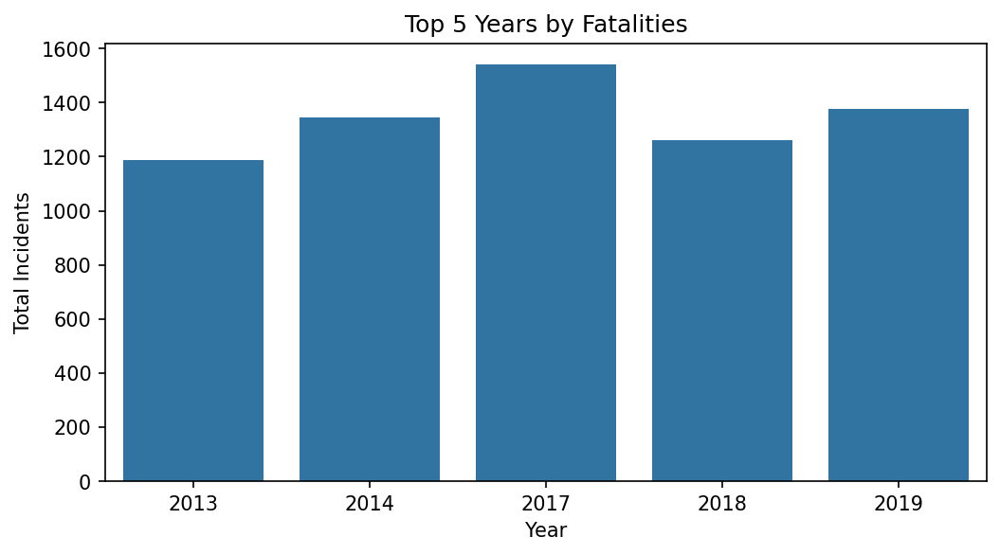

---

### 2. Scaffold-related Incidents by Year
- Sharp **peak in 2017 (~50 cases)**.  
- Decline after 2018.  
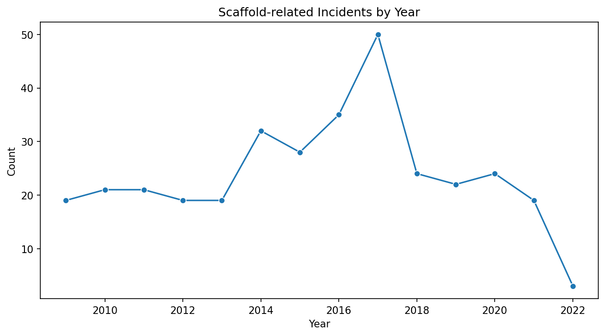

---

### 3. States with High % Unknown Citations
- **Washington ≈100% unknown** (worst reporting).  
- Other states with poor records: Nevada, North Dakota, New Mexico.  
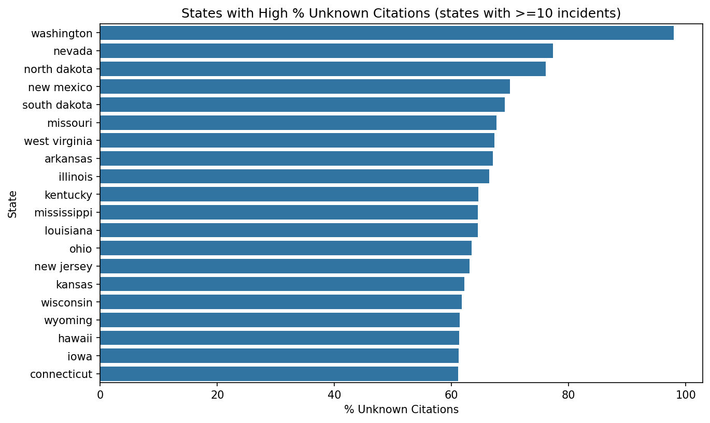

---

### 4. Rolling 12-month Fatalities
- Rise from **2010 to 2017 (~1400–1500)**.  
- Decline after 2017, hitting **~600 in 2022**.  
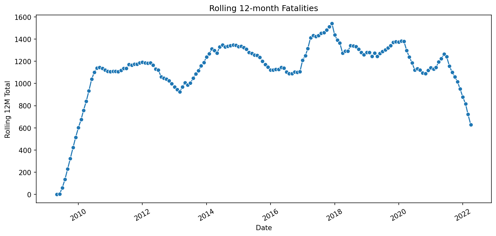

---

### 5. Weekday vs Weekend
- **Weekdays: ~13,500 incidents**.  
- **Weekends: ~1,900 incidents**.  
- 📌 Clear concentration during weekdays.  
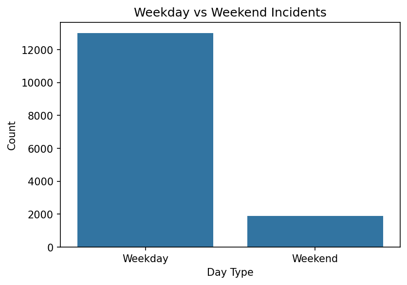

---

### 6. Day of Week Ranking
- **Tuesday & Wednesday** = riskiest days (~2700 each).  
- **Sunday** = safest (~700).  


---

### 7. States Reappearing in Top 5
- **California, Texas, Florida, New York, Illinois** dominate.  
- Consistently among top 5 for 12–14 years.  
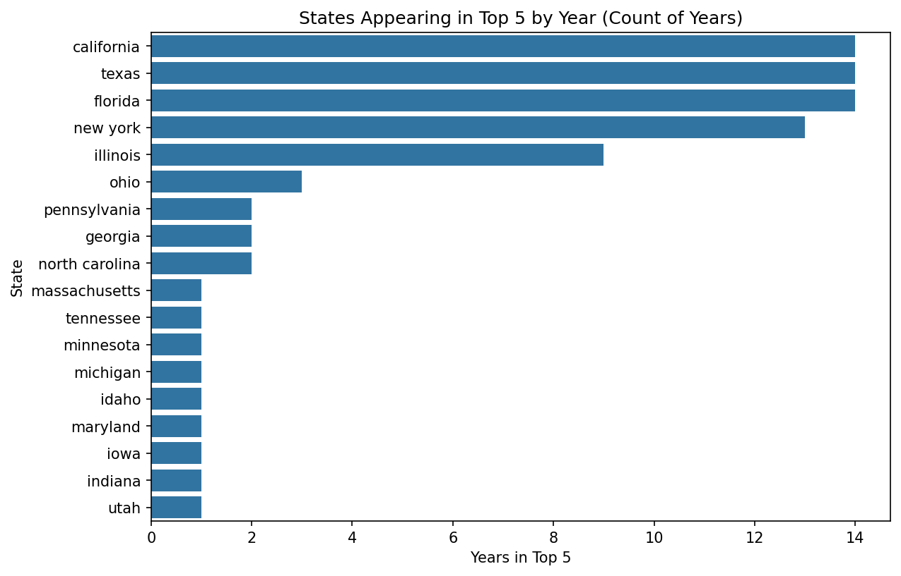

---

### 8. Top Words in Descriptions
- Most frequent: **died, struck, killed, fall, crushed**.  
- Indicates main accident causes.  
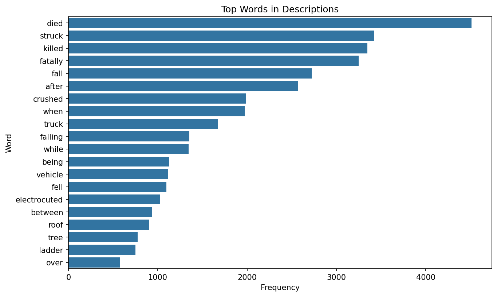

---

### 9. Cities with >50 Incidents
- **Houston (~210)**, **New York (~100)**, **Chicago (~100)**.  
- Other hotspots: Miami, Brooklyn, Dallas.  
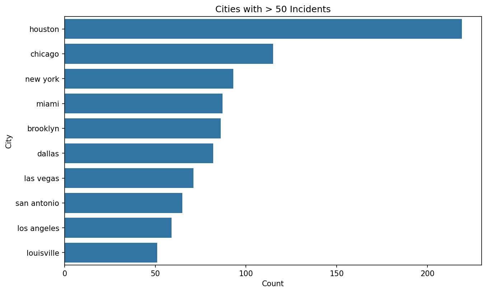

---

### 10. Average Incidents per Year by State
- Leaders: **Texas, California, Florida, New York, Illinois**.  


---

### 11. Heat-related Incidents
- Highest in **California, Texas, Florida, Louisiana**.  
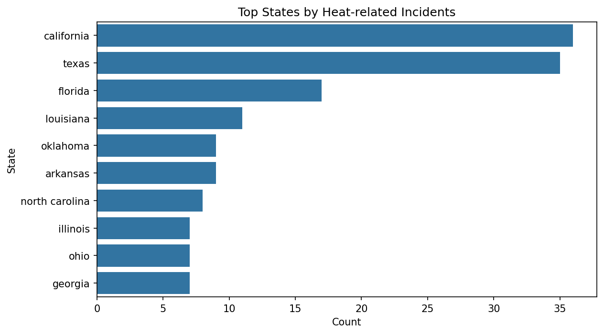

---

### 12. Quarterly Trends
- Peaks in **Q2–Q3 (summer months)**.  
- 2017–2019 = highest density.  


---

### 13. Causes by Keywords
- **Struck (~3400)** = leading cause.  
- Followed by **fall (~2600)**, **electrocution (~900)**.  
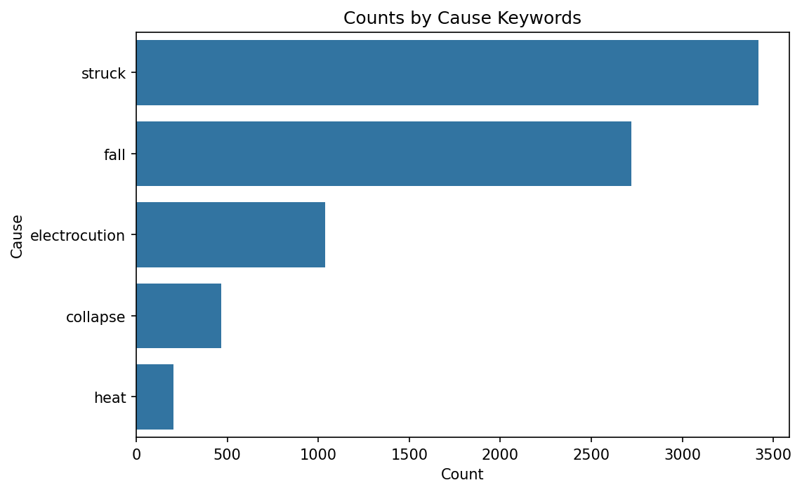

---

### 14. Ladder-related Fatalities
- Highest in **Texas (~85)**, **California (~75)**, **Florida (~60)**.  
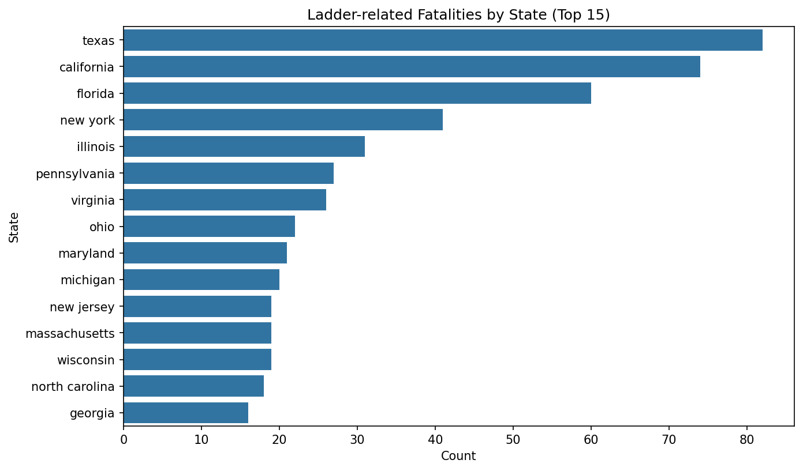

---

### 15. Year-over-Year Growth
- Strong growth in **2011 (+110%)**.  
- Peak again in **2017 (+40%)**.  
- **2022 shows sharp decline (-90%)**.  
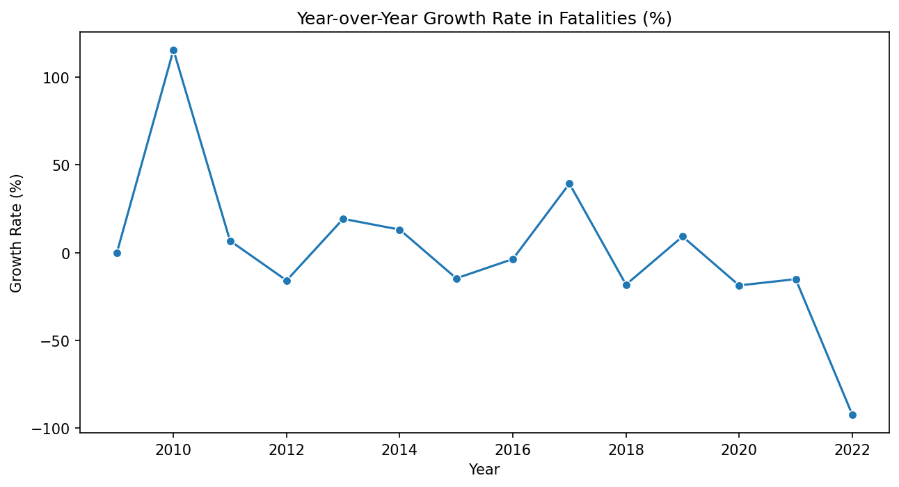

---

### 16. Monthly Fatalities
- **July & August (~1500 each)** = deadliest months.  
- **February (~1000)** = lowest.  
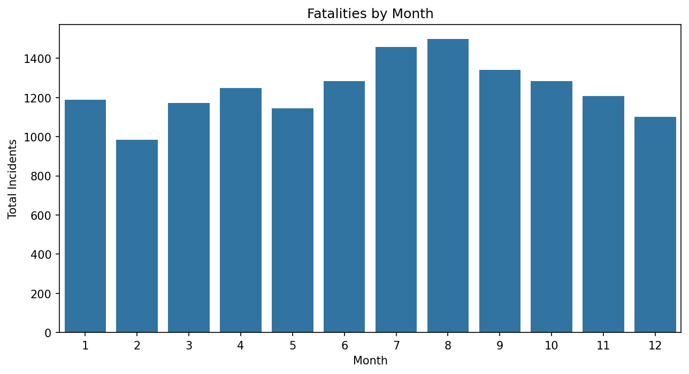

---

### 17. Top States & Cities
- **Texas (~1700), California (~1400), Florida (~1000)** = top states.  
- **Houston, Chicago, New York** lead among cities.  
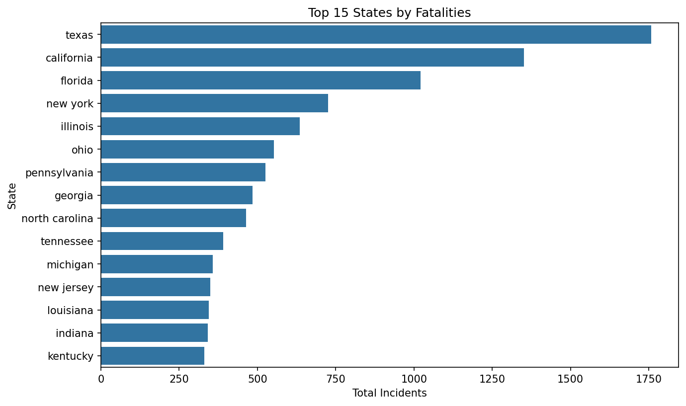  
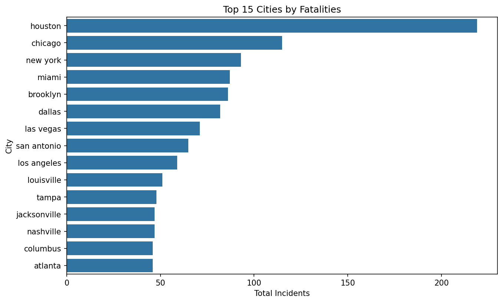

---

## 📈 Power BI Dashboard
An interactive **Power BI dashboard** is being developed to provide dynamic exploration of fatalities data.  
📌 Will include filters by **state, cause, and time period**.  

---

## ✅ Recommendations
- Target interventions in **high-risk states and cities**.  
- Improve **reporting completeness** (reduce "unknown" citations & plans).  
- Focus on **scaffold, ladder, and heat-related safety training**.  
- Address **summer peak incidents** with extra safety policies.  

---

## 👤 Author
**Mohamed Emad Elhadi**  
_Data Analyst_  
